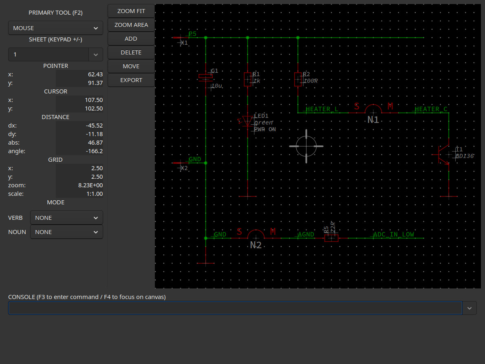
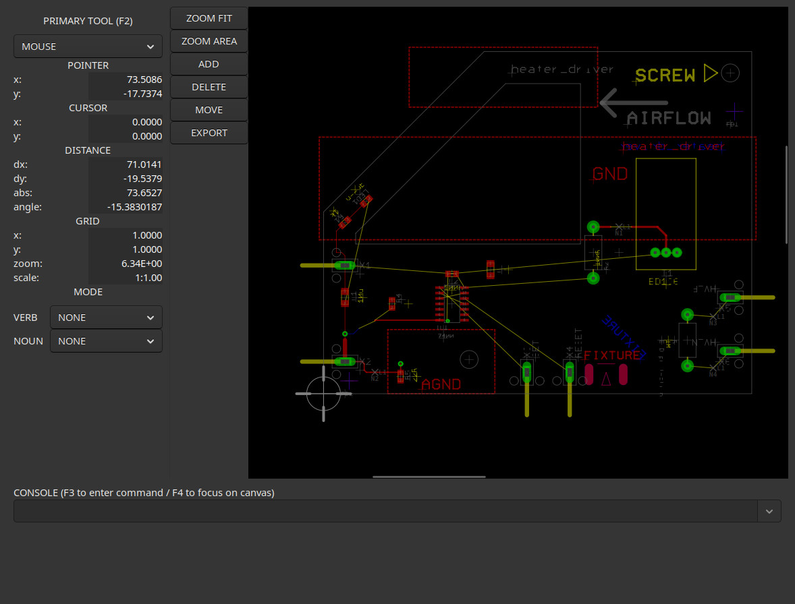

# SYSTEM ET
## An ECAD-Tool for complex schematics and layouts

### The Idea behind
- Most ECAD tools do not allow opening, checking and editing of multiple designs simultaneously.
- We need real hierarchic and modular designs.
- We need a text based, machine and human readable format for design files.
- Design checks provided by common ECAD tools are way too superficial and trivial.
- Style guides must be checked against.
- The tool must be highly scripting capable (Everything that can be done via the GUI must also be possible via commandline or script.).
- We want to do agile hardware develpment which requires the features mentioned above.
- The tool must be open sourced.
- Currently the GUI is under construction.
- Your feedback and collaboration is highly welcome !

### Outstanding Features
- native Linux support
- ASCII / text based design and device model files - optimized for version control with GIT
- human readable and editable design and model files
- multi-schematic/board/layout support
- true hierarchic and modular design with interfaces at the module boundaries
- submodules instantiated in parent module by reference
- extensive design rule checking (device prefixes, purpose of user-interactive devices, partcodes, pinout of board-to-board connections ...)
- interfacing with system modelling tools

### Examples of design and component models
- A module file (containing schematic and layout stuff) looks like 
this <https://github.com/Blunk-electronic/ET_training/blob/master/demo/heater_driver.mod>
- An example script file can be seen here 
 <https://github.com/Blunk-electronic/ET_training/blob/master/demo/test_device_commands.scr>
- There is a strict separation between symbol, package/footprint and device:
- Device model <https://github.com/Blunk-electronic/ET_component_library/blob/master/devices/active/logic/7400_ext.dev>
- Symbol model <https://github.com/Blunk-electronic/ET_component_library/blob/master/symbols/logic/NAND.sym>
- Package model <https://github.com/Blunk-electronic/ET_component_library/blob/master/packages/S_SO14.pac>
- A so called rig-configuration that describes module instances and board-to-board connections
 <https://github.com/Blunk-electronic/ET_training/blob/master/demo/demo.rig>

<!--### Example of an ERC configuration file
- See this example <https://github.com/Blunk-electronic/ET/blob/master/examples/conf.txt>-->


### Demo Project
A dummy project to test the code and to show features can be found in the
repository at <https://github.com/Blunk-electronic/ET_training>. You should clone 
it in a test directory like:

```sh
cd tmp
git clone git@github.com:Blunk-electronic/ET_training.git
```

Parallel to to the demo project you need the component libraries:

```sh
git clone git@github.com:Blunk-electronic/ET_component_library.git
```

Finally you shuld have these two directories:
```sh
ls
ET_component_library  ET_training
```

Now change in to the demo project:
```sh
cd ET_training
```

Start ET along with the demo project:
```sh
et --open-project demo
```

The directory you are currently in contains some other test projects
which are currently not used.

Now you should see the schematic editor and the layout editor window with a
useless dummy project.





For debugging the log level can be specified:
```sh
et --open-project demo --log-level 5
```

The debug and messages log can be found in file ET/reports/messages.log.
The greater the log level, the more messages will the log file contain.

Useful for testing is the feature to execute a script right away on opening
the project:

```sh
et --open-project demo --log-level 4 --script demo/test_schematic_group.scr 
```


### Documentation

User Manual <http://www.blunk-electronic.de/ET/pdf/caesystemet.pdf>

Documentation uses [Sphinx](https://www.sphinx-doc.org).
The required Python dependencies can be installed using [uv](https://docs.astral.sh/uv/):

```sh
uv sync
```

and built with:

```sh
cd doc
uv run make html
```

For those interested in the basic mechanisms of the canvas engine, a textbook is available
at <http://www.blunk-electronic.de/en/index.html>.


### Installation
- Currently there is no proper install script.
- Install the following packages: 
    - the GNAT Ada compiler (version 9 or later). It should come along with major linux distros.
    - make
    - gprbuild
    - gtkada 

- Find a installation howto for gtkada and gprbuild here <https://github.com/Blunk-electronic/ada_training>

- Change into src/et and follow the instructions in readme.txt.

<!--- Run the install script install.sh as non-root user.

```sh
$ sh install.sh
```

- The script installs the executable binary et in $HOME/bin and further-on creates a hidden directory .ET in $HOME where other configuration files live.
- Currently there is nothing to do in the configuration directory -> leave it as it is.
- For help contact info@blunk-electronic.de . You are highly welcome :-)-->

#### Why Ada ??
- The only programming language that provides a robust and strong typing system is Ada.
- Objects and structures within a schematic, library and board layout are very very complex things and require sound modelling.
- If saftey/mission critical and military applications use Ada, then is must be good for an advanced ECAD system as well.
- Ada is defined by ISO/IEC 8652:2012 and MIL-STD-1815
- Ada is beautiful :-)

### Roadmap and required Contribution
Your help is appreciated and is highly welcome !
For most of the issues below a separate issue exists on the GitHub page.
All code must be written in Ada for the reasons mentioned above.

#### Major Construction Sites
- graphical editors for symbol, package/footprint and device models
- CAM processor
- export PDF, PNG, ...
- import and append native ET modules to current active module
- import EAGLE and KiCad projects and component libraries
- realization of true hierarchical design
- net converter checks connector pinouts of modules

#### Miscellaneous
- zero-Ohms resistors
- accessories of components (screws, washers, clamps, ...)
- web browser support so that ET can be operated on every operating system
- a nice web site for the project

